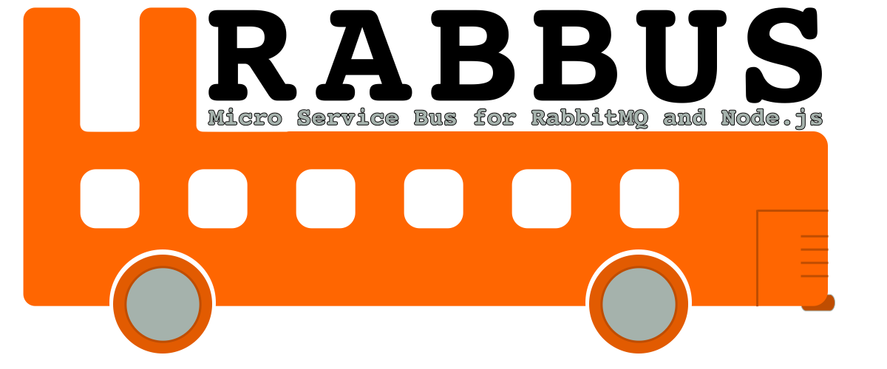

A highly opinionated, yet minimal, set of message bus abstractions for NodeJS.
It is built on top of [RabbitMQ](http://rabbitmq.com), 
with [rabbot](https://github.com/arobson/rabbot) as the primary library
for working with RabbitMQ.

## About Rabbus

The service bus implementation is basic, but includes several of the most 
common patterns:

* Send / Receive
* Publish / Subscribe
* Request / Response

The items on the left are "producers" as they produce a message for RabbitMQ
to route and handle. Items on the right are "consumers" as they consume a
message from a queue in RabbitMQ. 

Producers and Consumers inherit from a base class of that name, providing
common functionality and a means by which all producers / consumers can be
extended (see "middleware" below).

## Installing Rabbus

It's all NPM. You're going to want the 'rabbot' package with this, so you will
need to do two things:

```
npm install --save rabbot rabbus
```

Please note that rabbot is explicitly NOT mentioned as a dependency in the
Rabbus package.json file for runtime dependencies. This is done with intent, to help prevent library
version conflicts.

## Upgrading Rabbus

If you are upgrading Rabbus from a previous version, be sure to
read [the Upgrade Guide](UPGRADING.md).

## Rabbus Demos

There are several demos available to show the basic use of Rabbus. These demos
can be found in the [/demos](demos) folder, including:

* Send / Receive
* Publish / Subscribe
* Request / Response

Be sure to [read the demo documentation](/docs/demos.md) for information
on how to run these demos.

## Rabbus Documentation

Detailed Rabbus documentation can be found in the [docs](docs) folder, with a file for
each of the major aspects of Rabbus.

### Core Documents

Messaging Patterns:

* [Send / Receive](docs/send-receive.md)
* [Publish / Subscribe](docs/publish-subscribe.md)
* [Request / Response](docs/request-response.md)

Other Documentation:

* [Topology Management](docs/topology.md)
* [Middleware](docs/middleware.md)
* [Running The Test Suite](docs/testing.md)
* [Docker Configuration](docs/docker.md)

### Configuring RabbitMQ Connections

Please see the [rabbot](https://github.com/arobson/rabbot) documentation for information
on configuring RabbitMQ connections.

### Messaging Patterns

There are three pairs of pattern-based objects that come with Rabbus.
Each of them is meant to be used in combination with it's pair. You
are encouraged, however, not to use them directly. While this is certainly
possible, I find it is more convenient to inherit from these objects at the
point where they need to be used. The configuration of each object can then be
encapsulated for the intended use, allowing easier testing and maintenance.

There are a few commonalities between all of these object pairs. Most notably,
the object that sends a message to RabbitMQ only needs to know about the 
exchange to which it sends. Conversely, the object that consumes a message
from within RabbitMQ needs to know about both the exchange and the queue to 
which it subscribes.

### Basic API and Middleware

Rabbus uses a base message producer and consumer object to provide
the functionality of all message producers and consumers. This gives
a consistent API to all objects, and makes it easy to create your own
patterns and extend the Rabbus feature set.

All message consumers receive a common set of parameters when
consuming the message:

```js
<obj>.<consumerMethod>(function(message, properties, actions, next){
});
```

Each of these parameters gives you specific information or callable
function to continue processing or completing the process.

For definitions of these parameters, please see the [middleware documentation](docs/middleware.md)

### Topology

In addition to the pattern objects, Rabbus also includes a topology object and 
use of middleware within it's objects. These object types allow much greater
freedom and flexibility with Rabbus, when needed. 

The Topology object allows you to pre-define and build the needed topology for
your RabbitMQ scenario. You can also use existing topology constructs (exchanges,
queues and bindings) with a Topology, preventing Rabbus from attempting to
re-create them.

See the [topology documentation](docs/topology.md) for more information.

### Sending Custom Message Properties

RabbitMQ allows you to specify any number of custom headers and other properties,
and [rabbot](https://github.com/arobson/rabbot) allows you to manipulate
them as needed.

With Rabbus, you can also pass any arbitrary properties or headers that you wish,
when sending a message. This is done in a few ways.

0. Middleware - see the documentation below
0. A key/value list when sending a message

To use a key/value list, provide an object with keys / values in either the
`send` or `publish` method of the Sender / Publisher objects (below).

For example:

```js
sender.send(someMessage, {
  expiresAfter: 1000,
  headers: {
    foo: "bar"
  }
});
```

This will send a message with a TTL of 1 second (1000ms), and a header of
`foo: bar`.

### Callback After Sending message

If you want to specify both a properties object and provide a callback
method to fire after the message is sent, the callback can be specified as an
`onComplete` attribute of the properties:

```js
sender.send(someMessage, {
  expiresAfter: 1000,
  onComplete: function(){
    console.log("the message has been sent!");
  }
});
```

If you don't specify an object literal, you can provide a callback function
directly as the second parameter.

```js
sender.send(someMessage, function(){
  console.log("the message has been sent!");
});
```

### Limit Message Processing

If you need to limit the number of messages being processed by any given
messgae handler, you can specify a `limit` in the configuration.

```
function SomeSubscriber(){
  Rabbus.Subscriber.call(this, rabbot, {
    // ...
    queue: {
      // ...
      limit: 1
    }
  });
}
```

This will limit your `SomeSubscriber` to only working on one message at a time.
When your processing code calls `done`, the next message will be picked up
and processed.

### NoBatch: Ack / Nack Individual Messages

rabbot's default behavior is to batch process `ack` and `nack`
calls on messages. This can lead to an improvement of up to 400%
throughput in processing small things. In scenarios where there
are very long running processes that leave a message unacknowledged
for extended periods, though, this can be troublesome.

To prevent issues with batching ack / nack calls, rabbot and
Rabbus provide a `noBatch` option for Queue definitions.

```js
var Subscriber = new Rabbus.Subscriber({
  // ...
  queue: {
    //... 
    noBatch: true
  }
});
```

The following Rabbus objects provide the `noBatch` feature:

* Rabbus.Receiver
* Rabbus.Subscriber
* Rabbus.Responder

### The messageType Attribute

Rabbus is built on top of the rabbot library, which uses a
`messageType` attribute for messages. The behavior of the 
`messageType` attribute makes rabbot and Rabbus behave 
somewhat differently than RabbitMQ / AMQP on their own.

Internally, rabbot uses an in-memory messaging library called 
Postal.js to facilitate message delivery to consumer functions. 
The `messageType` attribute is used by postal as it's own form 
of a routing key. 

Because of this, you can have two consumers receive a copy of
a single message from a single queue... or, have messages from
different queues show up in a single subscriber.

```js
c1 = new Rabbus.Subscriber({
  // ...
  exchange: "foo",
  routingKey: "foo",
  queue: "foo",
  messageType: "foo" // <= note the message type
});

c2 = new Rabbus.Subscriber({
  // ...
  exchange: "bar",
  routingKey: "bar",
  queue: "bar",
  messageType: "foo" // <= same message type
});

c1.subscribe(function(msg, props, actions){
  console.log("c1 got it!");
  actions.ack();
});

c2.subscribe(function(msg, props, actions){
  console.log("c2 got it!");
  actions.ack();
});
```

In this example, it is highly likely that you will receive both
a "c1 got it!" message and a "c2 got it!" message in the 
console, when publishing a message for c1 to consumer.  This 
happens because of the `messageType` being the same. rabbot
has internally used the `messageType` to say that both the c1
and c2 handler methods should receive the message.

Leaving the `messageType` blank will cause rabbot to use the
routing key for the message, as the means by which it delivers
messages to handlers. As long as you are using unique routing
keys, you should probably leave the `messageType` blank. 

That's not to say there isn't value in what rabbot does. This
is just different than standard RabbitMQ/AMQP.

## Legalese

Rabbus is Copyright &copy;2016 Muted Solutions, LLC. All Rights Reserved. 

Rabbus is distributed under the [MIT license](http://mutedsolutions.mit-license.org).
